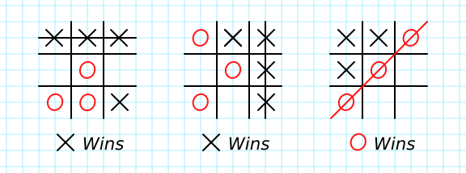

# Tic Tac Toe

> A simple tic tac toe game made with Ruby to play directly from the Terminal. This project is part of the Ruby Module of Microverse.

### What is Tic Tac Toe

Tic Tac Toe is a logical game for two players, each of them represented by one letter (X and O), where they take turns marking the spaces in a 3×3 grid. The player who succeeds in placing three of their marks in a diagonal, horizontal, or vertical row is the winner.

This is how you can score a win in Tic Tac Toe:

### How to Play it

If you do not have **Ruby on your computer**, worry not. Just click on the 'Play it Online' on the 'Live Demo' section below.
If you do, you can either play it locally (by following the instructions below, on 'Getting Started') or online as well.

If you're on the live demo, select the 'Console' Tab and hit the 'Play' button (represented by the icon in the green color, on the right side of the image)

After starting your game, here's how to play:
- Grab your best pal to play with you
- Enter your name and press enter
- Repeat the process for your partner

- :warning: **Important: the first player to put their name will be the first to play, and will always be the X. The other one will be the O. So remember to switch places every match!!** :warning:
- Press the ENTER key on your keyboard!
- Now you should be seeing the grid, with the numbers marking up the grid in each position available

- Check who's turn it is, and then type the desired position number and press ENTER to make your move!

- After this long-lasting battle, whoever manages to place 3 letters in a row, WINS!
- If none of you can do it, it is a TIE! Which means that you both are doing great. Or maybe not

## Built With

- Ruby

## Live Demo

[Live Demo Link](https://replit.com/join/ucvgktwi-fernandorpm)

## Getting Started

### Prerequisites

- Ruby

### Setup

- Create a new folder/directory for the project
- Be sure to have a Github account and that this account is connected locally on your PC

### Install

- Go to the desired directory on your terminal
- `git clone https://github.com/fernandorpm/tictactoe-ruby.git`

### Run

- On your terminal, type `bin/main.rb`

## Authors

👤 **Fernando R P Marques**

- GitHub: [@fernandorpm](https://github.com/fernandorpm)
- Twitter: [@rpm_fernando](https://twitter.com/rpm_fernando)
- LinkedIn: [fernandorpm](https://linkedin.com/in/fernandorpm)

👤 **John Arboleda**

- Github: [@John-Arboleda](https://github.com/John-Arboleda)
- Twitter: [@John_J_Arboleda](https://twitter.com/John_J_Arboleda
)
- Linkedin: [John Arboleda](https://www.linkedin.com/in/john-jairo-arboleda-castillo/)

## 🤝 Contributing

Contributions, issues, and feature requests are welcome!

Feel free to check the [issues page](../../issues/).

## Show your support

Give a ⭐️ if you like this project!

## 📝 License

This project is [MIT](./MIT.md) licensed.
